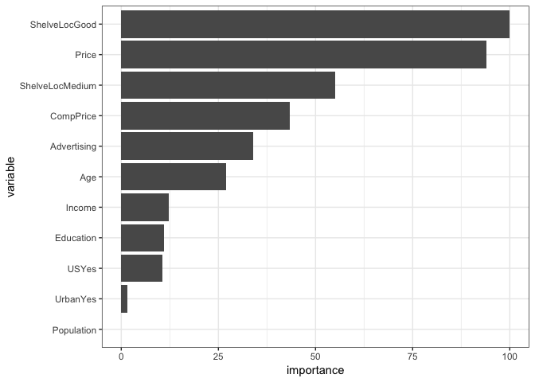

Homework 4: Bags, Forests, Boosts, oh my
================
Jacob Dubbert
2/28/2019

Problem 1
---------

Problem 7 from Chapter 8 in the text. To be specific, please use a sequence of `ntree` from 25 to 500 in steps of 25 and `mtry` from 3 to 9 for by 1.

Answer 1
--------

``` r
set.seed(1)
df <- tbl_df(Boston)
inTraining <- createDataPartition(df$medv, p = .75, list = F)
training <- df[inTraining,]
testing <- df[-inTraining,]
```

``` r
set.seed(1982)
trees <- seq(25,500, by=25)
mtry1 <- seq(3,9, by=1)
rf_boston_cv <- train(medv ~ .,
                      data = training,
                      method = "rf",
                      ntree = 500,
                      importance=T,
                      tuneGrid = data.frame(mtry = mtry1))
rf_boston_cv
```

    ## Random Forest 
    ## 
    ## 381 samples
    ##  13 predictor
    ## 
    ## No pre-processing
    ## Resampling: Bootstrapped (25 reps) 
    ## Summary of sample sizes: 381, 381, 381, 381, 381, 381, ... 
    ## Resampling results across tuning parameters:
    ## 
    ##   mtry  RMSE      Rsquared   MAE     
    ##   3     3.626573  0.8545634  2.380776
    ##   4     3.520698  0.8600717  2.320952
    ##   5     3.471677  0.8618174  2.285208
    ##   6     3.442539  0.8630820  2.279245
    ##   7     3.427488  0.8632484  2.277028
    ##   8     3.439639  0.8617120  2.285183
    ##   9     3.438674  0.8612026  2.288504
    ## 
    ## RMSE was used to select the optimal model using the smallest value.
    ## The final value used for the model was mtry = 7.

``` r
registerDoMC(cores = 4)

set.seed(1982)
ntrees <- seq(25,500, by=25)
mse_test <- tibble(ntree = ntrees,
                   mtry_3= 1:20,
                   mtry_4= 1:20,
                   mtry_5= 1:20,
                   mtry_6=1:20,
                   mtry_7=1:20,
                   mtry_8=1:20,
                   mtry_9=1:20)
mtry1 <- seq(3,9, by=1)


for (nti in 1:length(ntrees)) {
  rf_boston_cv2 <- train(medv ~ .,
                      data = training,
                      method = "rf",
                      ntree = ntrees[nti],
                      importance=T,
                      tuneGrid = data.frame(mtry = 3:9))
  mse_test[nti, 2:8] <- rf_boston_cv2$results$RMSE^2
}

mse_test <- melt(mse_test, id.vars="ntree")
ggplot(mse_test, aes(ntree, value, col=variable)) + geom_line() + geom_point()
```


Problem 2
---------

Problem 8 from Chapter 8 in the text. Set your seed with 9823 and split into train/test using 50% of your data in each split. In addition to parts (a) - (e), do the following:

1.  Fit a gradient-boosted tree to the training data and report the estimated test MSE.
2.  Fit a multiple regression model to the training data and report the estimated test MSE
3.  Summarize your results.

<!-- -->

1.  

``` r
carseats <- Carseats
set.seed(9823)
inTraining <- createDataPartition(carseats$Sales, p = .5, list = F)
training <- carseats[inTraining,]
testing <- carseats[-inTraining,]
```

1.  

``` r
r_tree <- rpart(Sales~., data = training)
r_tree
```

    ## n= 201 
    ## 
    ## node), split, n, deviance, yval
    ##       * denotes terminal node
    ## 
    ##   1) root 201 1493.069000  7.465721  
    ##     2) ShelveLoc=Bad,Medium 162  931.485600  6.822222  
    ##       4) ShelveLoc=Bad 49  240.271900  5.210204  
    ##         8) Price>=102.5 35  131.203300  4.605143  
    ##          16) CompPrice< 137.5 27   72.802630  4.083704  
    ##            32) Population< 171.5 10   28.860560  3.098000 *
    ##            33) Population>=171.5 17   28.510590  4.663529 *
    ##          17) CompPrice>=137.5 8   26.282600  6.365000 *
    ##         9) Price< 102.5 14   64.221490  6.722857 *
    ##       5) ShelveLoc=Medium 113  508.667600  7.521239  
    ##        10) Price>=105.5 73  240.235300  6.706301  
    ##          20) Advertising< 13.5 59  165.356400  6.336102  
    ##            40) CompPrice< 121.5 18   15.182090  5.420556 *
    ##            41) CompPrice>=121.5 41  128.462200  6.738049  
    ##              82) Price>=131.5 16   37.749340  5.633125 *
    ##              83) Price< 131.5 25   58.677620  7.445200  
    ##               166) Age>=68 7    6.099143  6.087143 *
    ##               167) Age< 68 18   34.647600  7.973333 *
    ##          21) Advertising>=13.5 14   32.717120  8.266429 *
    ##        11) Price< 105.5 40  131.473500  9.008500  
    ##          22) Age>=50.5 27   54.832160  8.222963 *
    ##          23) Age< 50.5 13   25.377200 10.640000 *
    ##     3) ShelveLoc=Good 39  215.849000 10.138720  
    ##       6) Price>=127.5 13   41.850310  8.493846 *
    ##       7) Price< 127.5 26  121.239500 10.961150  
    ##        14) Education>=11.5 17   57.686200 10.060000 *
    ##        15) Education< 11.5 9   23.671200 12.663330 *

``` r
prp(r_tree)
```


``` r
plot(as.party(r_tree))
```


``` r
pred_test <- predict(r_tree, newdata = testing)
mean((testing$Sales-pred_test)^2)
```

    ## [1] 4.484515

The test MSE is 4.48

1.  

``` r
set.seed(9823)
fit_control <- trainControl(method = "repeatedcv",
                           number = 10, 
                           repeats = 10)

cv_boston_tree <- train(Sales ~.,
                        data = training,
                        method= "rpart2",
                        trControl=fit_control,
                        tuneGrid = data.frame(maxdepth= 1:10))
```

    ## Warning in nominalTrainWorkflow(x = x, y = y, wts = weights, info =
    ## trainInfo, : There were missing values in resampled performance measures.

``` r
cv_boston_tree
```

    ## CART 
    ## 
    ## 201 samples
    ##  10 predictor
    ## 
    ## No pre-processing
    ## Resampling: Cross-Validated (10 fold, repeated 10 times) 
    ## Summary of sample sizes: 180, 181, 181, 181, 181, 181, ... 
    ## Resampling results across tuning parameters:
    ## 
    ##   maxdepth  RMSE      Rsquared   MAE     
    ##    1        2.386609  0.2502462  2.002081
    ##    2        2.339570  0.2848321  1.913478
    ##    3        2.205471  0.3687289  1.801573
    ##    4        2.253889  0.3529630  1.835435
    ##    5        2.293972  0.3409969  1.854148
    ##    6        2.318822  0.3369173  1.879146
    ##    7        2.319414  0.3442876  1.872713
    ##    8        2.310316  0.3505416  1.864051
    ##    9        2.305573  0.3579987  1.856158
    ##   10        2.286577  0.3770154  1.822844
    ## 
    ## RMSE was used to select the optimal model using the smallest value.
    ## The final value used for the model was maxdepth = 3.

``` r
plot(cv_boston_tree)
```

 It looks like k=3 is the optimal level of tree complexity.

``` r
test_preds_cv <- predict(cv_boston_tree, newdata = testing)
mean((testing$Sales-test_preds_cv)^2)
```

    ## [1] 4.933184

Pruning the tree increases the MSE to 4.99.

1.  

``` r
bag_carseats <- randomForest(Sales ~ ., data = training, mtry = 10, ntree=500,importance=TRUE)
bag_carseats
```

    ## 
    ## Call:
    ##  randomForest(formula = Sales ~ ., data = training, mtry = 10,      ntree = 500, importance = TRUE) 
    ##                Type of random forest: regression
    ##                      Number of trees: 500
    ## No. of variables tried at each split: 10
    ## 
    ##           Mean of squared residuals: 2.843539
    ##                     % Var explained: 61.72

``` r
bag_predict <- predict(bag_carseats, newdata = testing)
mean((testing$Sales - bag_predict)^2)
```

    ## [1] 3.088444

Test MSE is 3.00

``` r
imp <- data.frame(importance(bag_carseats)[,-2])
rn <- rownames(imp)
imp_carseats <- data.frame(variable=rn,
                           importance=imp$importance.bag_carseats.....2.) %>% arrange(desc(-importance)) %>% mutate(variable= factor(variable, variable))
```

    ## Warning: package 'bindrcpp' was built under R version 3.4.4

``` r
p <- ggplot(imp_carseats, aes(variable, importance))
p+geom_col()+coord_flip()
```

 Bagging improves the test MSE to 3 and ShelveLoc, Price and CompPrice are the most important predictors of Sale.

1.  

``` r
rf_carseats <- randomForest(Sales ~., data = training, mtry=3, ntree=500, importance=T)
rf_carseats
```

    ## 
    ## Call:
    ##  randomForest(formula = Sales ~ ., data = training, mtry = 3,      ntree = 500, importance = T) 
    ##                Type of random forest: regression
    ##                      Number of trees: 500
    ## No. of variables tried at each split: 3
    ## 
    ##           Mean of squared residuals: 3.06296
    ##                     % Var explained: 58.77

``` r
rf_predict <- predict(rf_carseats, newdata = testing)
mean((testing$Sales-rf_predict)^2)
```

    ## [1] 3.564908

The test MSE is 3.55

``` r
rf_carseats_cv <- train(Sales ~ ., 
                      data = training,
                      method = "rf",
                      ntree = 500,
                      importance = T,
                      tuneGrid = data.frame(mtry = 1:10))
rf_carseats_cv
```

    ## Random Forest 
    ## 
    ## 201 samples
    ##  10 predictor
    ## 
    ## No pre-processing
    ## Resampling: Bootstrapped (25 reps) 
    ## Summary of sample sizes: 201, 201, 201, 201, 201, 201, ... 
    ## Resampling results across tuning parameters:
    ## 
    ##   mtry  RMSE      Rsquared   MAE     
    ##    1    2.287598  0.4918379  1.814685
    ##    2    2.045480  0.5677552  1.619582
    ##    3    1.946084  0.5881324  1.535953
    ##    4    1.887817  0.5954251  1.492601
    ##    5    1.861997  0.5924583  1.473194
    ##    6    1.844706  0.5887605  1.462363
    ##    7    1.845962  0.5811660  1.465828
    ##    8    1.850249  0.5717010  1.470199
    ##    9    1.852485  0.5673959  1.472049
    ##   10    1.861880  0.5598004  1.480669
    ## 
    ## RMSE was used to select the optimal model using the smallest value.
    ## The final value used for the model was mtry = 6.

``` r
plot(rf_carseats_cv)
```


``` r
rf_carseats7 <- randomForest(Sales ~., data = training, mtry=7, ntree=500, importance=T)
rf_carseats7
```

    ## 
    ## Call:
    ##  randomForest(formula = Sales ~ ., data = training, mtry = 7,      ntree = 500, importance = T) 
    ##                Type of random forest: regression
    ##                      Number of trees: 500
    ## No. of variables tried at each split: 7
    ## 
    ##           Mean of squared residuals: 2.794826
    ##                     % Var explained: 62.38

``` r
rf_predict7 <- predict(rf_carseats7, newdata = testing)
mean((testing$Sales-rf_predict7)^2)
```

    ## [1] 3.094055

The test MSE picking the best mtry through CV is 3.05.

``` r
importance(rf_carseats7)
```

    ##               %IncMSE IncNodePurity
    ## CompPrice   17.609840    138.960707
    ## Income      10.333261    121.183345
    ## Advertising 14.028475    130.428117
    ## Population  -1.500738     60.481238
    ## Price       41.110729    330.358158
    ## ShelveLoc   50.123059    463.200520
    ## Age         12.481359    114.765924
    ## Education    4.116884     55.136542
    ## Urban       -1.030426      8.271235
    ## US           4.015995     17.445998

The test MSE is worse in this case for the Random Forest model barely from 3 in the Bagging model to 3.06 in the RF. Chaning m varies the test MSE between 3 and 3.61.Again, the most important predictors for Sales are ShelveLoc, Price and CompPrice.

``` r
imp <- varImp(rf_carseats_cv)$importance
rn <- rownames(imp)
imp_rf <- data.frame(variable=rn,
                     importance=imp$Overall) %>% 
  arrange(desc(-importance)) %>% 
  mutate(variable = factor(variable, variable))
p<- ggplot(imp_rf, aes(variable, importance))
p + geom_col()+coord_flip()
```


